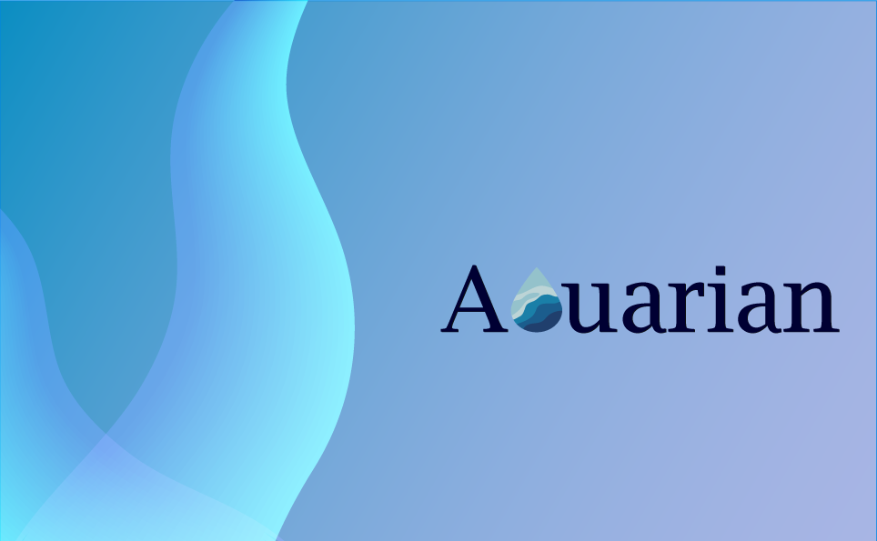

 

## Hello, we are team Aquarian !

  
Our team consists of 5 people, whose goal was to
create a fun, functional and educational game on
the theme "Protection of water resources". Water is an integral part
of our lives, without which we cannot survive.
That is why its protection it's so important. With
our team we hope to encourage more young people,
through playing, to learn to protect and value the water,
because it's not endless!   
You can see our presentation here:
<a href="Presentation and Documentation/Presentation.pptx" >Presentation</a>

 

# Participants

 

•Emily Kehayova - Scrum Trainer <a href="mailto:KKYaneva19@codingburgas.bg">Send email</a>  
•Vesela Dekova - Graphic designer <a href="mailto:VBDekova19@codingburgas.bg">Send email</a>  
•Galin Georgiev - Developer Back-end  <a href="https://github.com/GalinGeorgiev322">Send email</a>  
•Martin Martinov - Developer Back-end  <a href="https://github.com/MVMartinov19">Send email</a>  
•Maksim Vasilev - Developer Front-end <a href="https://github.com/MDVasilev20">Send email</a>   

 

# Used technologies

 

Word  
Teams  
 Instagram  
PowerPoint   
 Visual Studio Code  
 Adobe Illustrator  

 

# Future ideas

 

1. To improve the logo.  
2. To add а better style to the site.  
3. To add more forms.  
4. To use database.  
5. To make 5th level of the game.  

 

# Here is how to download our repo:

 

 - Open cmd with Windows + "R";  
 - Type the directory where you want to download the repo;  
 - Type git clone + https://github.com/edkehayova18/Aquarian.git;  
 
Or you can download it from the site.

